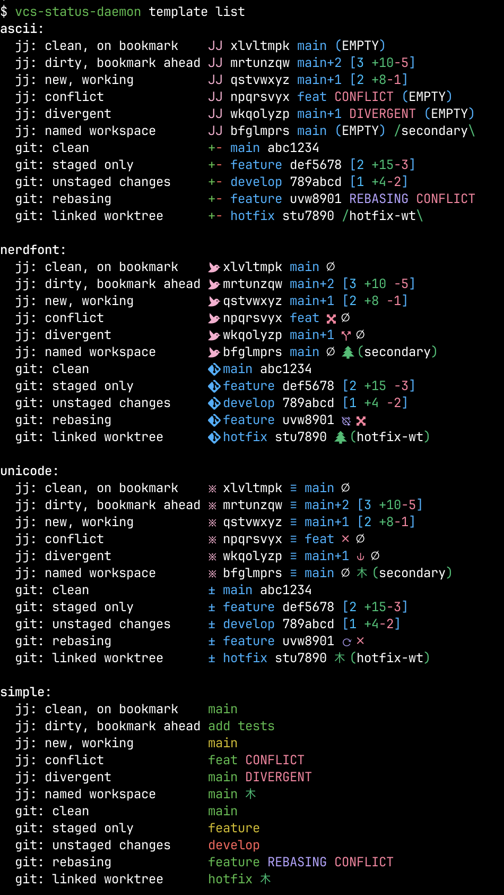

# vcs-status-daemon

A background daemon that pre-caches [Jujutsu](https://github.com/jj-vcs/jj) and Git repository status, so shell prompts can retrieve it in milliseconds instead of waiting for `jj` or `git` to run on every prompt.

> [!WARNING]
> This project is entirely AI generated but it seems to work 🤖 🤷

## Problem

VCS tools like `jj` and `git` can be slow in large repositories. Shell prompt integrations that call them on every prompt add noticeable latency. This daemon watches for repository changes via filesystem notifications and keeps a formatted status string in memory, ready to serve instantly — giving you a single, fast status tool for both Jujutsu and Git repos.

## Architecture

```
Shell prompt calls:   vcs-status-daemon         (client mode, the default)
                          |
                          | connects to Unix domain socket
                          v
                      vcs-status-daemon daemon   (background server)
                          |
                          +-- detects VCS type (jj wins if both .jj/ and .git/ exist)
                          +-- watches repo via filesystem notifications (notify)
                          +-- on change: shells out to jj or git, caches formatted status
                          +-- serves cached text to clients instantly
```

- **Single binary, two modes**: `daemon` (background server) and default (client/query)
- **Auto-start**: the client spawns the daemon automatically if it's not running
- **Multi-repo**: the daemon tracks multiple repositories, each with its own filesystem watcher
- **Dual VCS**: supports both jj and git repositories, with jj taking priority when both are present
- **Idle shutdown**: the daemon exits automatically after 1 hour (configurable) with no queries

## Installation

Requires a working `jj` and/or `git` CLI installation.

Install prebuilt binaries via shell script

```shell
curl --proto '=https' --tlsv1.2 -LsSf 'https://github.com/quodlibetor/vcs-status-daemon/releases/latest/download/vcs-status-daemon-installer.sh' | sh
```

Install prebuilt binaries via Homebrew or Linuxbrew:

```shell
brew install 'quodlibetor/tap/vcs-status-daemon'
```

Install prebuilt binaries via [mise](https://mise.jdx.dev/)

```shell
mise use -g 'github:quodlibetor/vcs-status-daemon@latest'
```

Install via cargo:

```shell
cargo install --git 'https://github.com/quodlibetor/vcs-status-daemon'
```

Or go to the [Releases](https://github.com/quodlibetor/vcs-status-daemon/releases) and download an artifact directly.

## Usage

### Shell prompt integration

The easiest thing to do is to just stick it in your prompt, this will work and averages ~2ms for me:

```zsh
PS1='$(vcs-status-daemon) \$ '
```

To be even faster you can avoid a subprocess spawn by initializing a shell function.

Add the following to your shell rc file. This sets a `VCS_STATUS` environment variable before each prompt — use it in your prompt however you like.

```zsh
# .zshrc
eval "$(vcs-status-daemon init zsh)"
PS1='%~ ${VCS_STATUS}%# '
```

```bash
# .bashrc
eval "$(vcs-status-daemon init bash)"
PS1='\w ${VCS_STATUS}\$ '
```

#### With starship

```zsh
# .zshrc
eval "$(vcs-status-daemon init zsh --starship)"
```

```bash
# .bashrc
eval "$(vcs-status-daemon init bash --starship)"
```

The `--starship` flag warns if it can't find your `starship.toml` or if it's missing the `[env_var.VCS_STATUS]` section. Add this to your `starship.toml`:

```toml
# Disable starship's built-in git modules (vcs-status-daemon handles both jj and git)
[git_branch]
disabled = true

[git_commit]
disabled = true

[git_status]
disabled = true

[git_state]
disabled = true

[env_var.VCS_STATUS]
format = "$env_value "
```

### Commands

```sh
# Query status for the current directory (default, auto-starts daemon)
vcs-status-daemon

# Query a specific path
vcs-status-daemon query --repo /path/to/repo

# Start the daemon explicitly
vcs-status-daemon daemon

# Start the daemon with a custom runtime directory
vcs-status-daemon daemon --dir /tmp/my-daemon

# Shut down the daemon
vcs-status-daemon shutdown

# Restart the daemon (graceful shutdown + restart)
vcs-status-daemon restart

# Show daemon status (running, PID, uptime, watched repos)
vcs-status-daemon status

# Generate shell integration code (sets $VCS_STATUS before each prompt)
vcs-status-daemon init zsh [--starship]
vcs-status-daemon init bash [--starship]

# Manage config
vcs-status-daemon config init    # write default config file
vcs-status-daemon config edit    # open config in $EDITOR
vcs-status-daemon config path    # print config file path

# Preview templates
vcs-status-daemon template list              # show all built-in templates with sample output
vcs-status-daemon template format "{{ change_id }}"  # test a custom template
```

The client sends its current directory to the daemon, which walks up the directory tree to find a repo root (`.jj/` or `.git/`). The mapping from directory to repo root is cached. When run outside a recognized repository, the client exits silently with exit code 0, making it safe for unconditional prompt use.

### Runtime directory

Both client and daemon resolve paths from a shared runtime directory:

1. `VCS_STATUS_DAEMON_DIR` environment variable (if set)
2. Default: `/tmp/vcs-status-daemon-$USER/`

The directory contains:
- `sock` — Unix domain socket
- `pid` — daemon PID file (for `restart` and `status`)
- `cache/` — cached status files (read by the shell function for the fastest path)
- `daemon.log` — log output (rotated at 5 MB)

The daemon also accepts a `--dir` CLI flag, which takes priority over the environment variable. When the client auto-starts the daemon, it always passes its resolved directory via `--dir` to ensure both sides agree.

## Configuration

Configuration is loaded from `~/.config/vcs-status-daemon/config.toml`. All fields are optional and have sensible defaults.

```toml
# How long the daemon stays alive with no queries (seconds, default: 3600)
idle_timeout_secs = 3600

# Debounce delay for filesystem events before refreshing (ms, default: 200)
debounce_ms = 200

# How many ancestor commits to search for bookmarks in jj repos (default: 10)
bookmark_search_depth = 10

# Enable ANSI color output (default: true)
color = true

# Built-in template to use: "ascii" (default), "nerdfont", "unicode", or "simple"
template_name = "ascii"

# Explicit format template (Tera syntax, overrides template_name if set)
# format = "..."

# User-defined named templates (selected via template_name)
# [templates]
# my_template = "{{ change_id }} {{ description }}"
```

## Format template

The `format` field is a [Tera](https://keats.github.io/tera/docs/) template string. Tera uses `{{ variable }}` for interpolation, `` / `` / `` for conditionals, and `` / `` for loops.

### VCS type detection

The daemon detects whether a repository uses jj or git (jj wins if both `.jj/` and `.git/` are present) and exposes `is_jj` and `is_git` booleans. Use these to write templates that work for both:

```tera
{{ change_id }}{{ branch }} {{ commit_id }}
```

### Template variables

#### VCS type

| Variable | Type | Description |
|---|---|---|
| `is_jj` | bool | `true` if the repo is a jj repository. |
| `is_git` | bool | `true` if the repo is a plain git repository (no `.jj/`). |

#### Shared fields (both jj and git)

| Variable | Type | Description |
|---|---|---|
| `commit_id` | string | Short commit ID. For jj repos with `color = true`, includes jj's native ANSI coloring. |
| `description` | string | First line of the commit description (jj) or commit message summary (git). |
| `empty` | bool | `true` if the working commit (jj) or HEAD commit (git) has no changes. |
| `conflict` | bool | `true` if there are conflicts (jj conflict markers or git merge conflicts). |

#### Diff stats

There are three groups of diff stat variables. For jj repos (which have no staging area), `files_changed` and `total_files_changed` are identical, and `staged_*` is always 0. For git repos, all three groups are independently populated.

| Variable | Type | jj | git |
|---|---|---|---|
| `files_changed` | integer | Files changed in `@` vs parent | Unstaged: working tree vs index |
| `lines_added` | integer | Lines added in `@` | Unstaged lines added |
| `lines_removed` | integer | Lines removed in `@` | Unstaged lines removed |
| `staged_files_changed` | integer | Always 0 | Staged: index vs HEAD |
| `staged_lines_added` | integer | Always 0 | Staged lines added |
| `staged_lines_removed` | integer | Always 0 | Staged lines removed |
| `total_files_changed` | integer | Same as `files_changed` | Total: working tree vs HEAD |
| `total_lines_added` | integer | Same as `lines_added` | Total lines added |
| `total_lines_removed` | integer | Same as `lines_removed` | Total lines removed |

The default template uses `total_*` since it gives the complete picture for both VCS types.

#### jj-only fields

These are populated only for jj repositories. In git repositories they are empty/false/zero.

| Variable | Type | Description |
|---|---|---|
| `change_id` | string | Short change ID (8 chars). With `color = true`, includes jj's native ANSI coloring. |
| `bookmarks` | list | List of bookmark objects (see below). |
| `has_bookmarks` | bool | `true` if any bookmarks were found in the ancestor search range. |
| `divergent` | bool | `true` if the working commit is divergent. |
| `hidden` | bool | `true` if the working commit is hidden. |
| `immutable` | bool | `true` if the working commit is immutable. |


#### git-only fields

These are populated only for git repositories. In jj repositories they are empty/false.

| Variable | Type | Description |
|---|---|---|
| `branch` | string | Current branch name, or short commit hash if HEAD is detached. |
| `has_branch` | bool | `true` if `branch` is non-empty. |
| `rebasing` | bool | `true` if a rebase is in progress (interactive or non-interactive). |

#### Workspace/worktree fields

| Variable | Type | Description |
|---|---|---|
| `workspace_name` | string | Workspace name (jj) or worktree directory name (git). `"default"` / `"main"` for the primary workspace/worktree. |
| `is_default_workspace` | bool | `true` if this is the default workspace (jj) or main worktree (git). |

#### Bookmark objects (jj only)

Each item in the `bookmarks` list has:

| Field | Type | Description |
|---|---|---|
| `name` | string | Bookmark name, e.g. `"main"`. |
| `distance` | integer | Number of commits between `@` and the bookmarked commit. `0` means the bookmark is on `@`. |
| `display` | string | Pre-formatted display string: `"main"` when distance is 0, `"main+2"` otherwise. |


#### Color filters

Colors are applied using Tera's filter syntax: `{{ value | green }}`. When `color = true`, filters wrap the value in ANSI escape codes. When `color = false`, filters are no-ops (the value passes through unchanged).

| Filter | ANSI code |
|---|---|
| `bold` | `\e[1m` |
| `dim` | `\e[2m` |
| `red` | `\e[31m` |
| `green` | `\e[32m` |
| `yellow` | `\e[33m` |
| `blue` | `\e[34m` |
| `magenta` | `\e[35m` |
| `cyan` | `\e[36m` |
| `white` | `\e[37m` |
| `bright_red` | `\e[91m` |
| `bright_green` | `\e[92m` |
| `bright_yellow` | `\e[93m` |
| `bright_blue` | `\e[94m` |
| `bright_magenta` | `\e[95m` |
| `bright_cyan` | `\e[96m` |
| `bright_white` | `\e[97m` |

You can apply filters to variables (`{{ branch | green }}`), string literals (`{{ "CONFLICT" | bright_red }}`), or concatenated values (`{{ "+" ~ total_lines_added | bright_green }}`).

### Built-in templates

Four templates are included. Select one with `template_name` in your config:

```toml
template_name = "nerdfont"
```

Preview all templates with representative sample outputs using `vcs-status-daemon template list`:



#### `ascii` (default)

Works in any terminal. Example output:

- **jj**: `JJ xlvlt main [3 +10-5]` or `JJ xlvlt (EMPTY)`
- **git**: `+- main abc1234 [3 +10-5]` or `+- main abc1234 (EMPTY)`

#### `nerdfont`

Requires a [Nerd Font](https://www.nerdfonts.com/). Uses iconic glyphs for VCS type, conflicts, divergence, etc. Example output:

- **jj**: `󱗆 xlvlt main [3 +10 -5]` or `󱗆 xlvlt ∅`
- **git**: `󰊢 main abc1234 [3 +10 -5]` or `󰊢 main abc1234 ∅`

#### `unicode`

Uses standard Unicode symbols (no Nerd Fonts needed). Example output:

- **jj**: `※ xlvlt ≡ main [3 +10-5]`
- **git**: `± main abc1234 [3 +10-5]`

#### `simple`

Just the branch or bookmark name, color-coded by state. Green = clean, yellow = changes, red = unstaged (git). For jj, shows the bookmark name, description, or change ID depending on context.

### User-defined templates

You can define your own named templates in the config and select them with `template_name`:

```toml
template_name = "minimal"

[templates]
minimal = "{{ commit_id }} {{ description }}"
```

User templates take priority over built-in ones — you can override `ascii` or `nerdfont` with your own version.

### Inline format override

The `format` field directly sets the template string, overriding `template_name`:

```toml
format = "{{ change_id }} {{ branch }}"
```

In TOML, use multi-line literal strings (`'''`) for readability. Use Tera's `{%-` whitespace trimming to prevent newlines from appearing in the output:

```toml
format = '''
{{ change_id }}
 {{ b.display | blue }}
{{ branch | blue }} {{ commit_id }}
'''
```

### Custom template examples

**jj-only, minimal** -- just change ID and bookmarks, no color:

```toml
color = false
format = '''
{{ change_id }}
 {{ b.display }}'''
```

**git-only, minimal** -- just branch and commit:

```toml
color = false
format = "{{ branch }} {{ commit_id }}"
```

**Verbose, both VCS** -- with description/state details:

```toml
format = '''
{{ change_id }} {{ commit_id | dim }}
 {{ b.display | blue }}
 {{ description | dim }}
{{ branch | blue }} {{ commit_id | dim }}

 {{ total_files_changed | bright_blue }}f {{ "+" ~ total_lines_added | bright_green }} {{ "-" ~ total_lines_removed | bright_red }}
 {{ "empty" | yellow }}
 {{ "conflict!" | bright_red }}'''
```

**Custom bookmark formatting** -- show distance differently (jj only):

```toml
format = '''
{{ change_id }}
 {{ b.name | cyan }}~{{ b.distance }}
 {{ "empty" | dim }}'''
```

## How it works

1. **Client** connects to the daemon's Unix domain socket. If the daemon isn't running, the client spawns it as a detached background process and retries.

2. **Daemon** receives a query with a directory path and walks up to find the repo root. It detects the VCS type (`.jj/` takes priority over `.git/`). On first query for a repo, it:
   - Sets up a filesystem watcher appropriate for the VCS type:
     - **jj**: watches `.jj/repo/op_heads/heads/` (operations) and the working directory
     - **git**: watches `.git/` and `.git/refs/` (ref changes) and the working directory
   - Shells out to `jj` or `git` to gather status info (commit, branch/bookmarks, diff stats)
   - Renders the format template and caches the result

3. **On filesystem changes**, the daemon debounces events (200ms default), then re-runs the appropriate VCS command and updates the cache. For jj repos, it uses `--ignore-working-copy` when only `.jj/` internal files changed (faster, avoids unnecessary snapshots), and omits it when working copy files changed (so `jj` snapshots first, giving accurate diff stats).

4. **Subsequent queries** return the cached string instantly.

## Development

```sh
# Run tests (requires jj and git to be installed)
cargo nextest run

# Or with plain cargo
cargo test

# Build
cargo build --release
```
