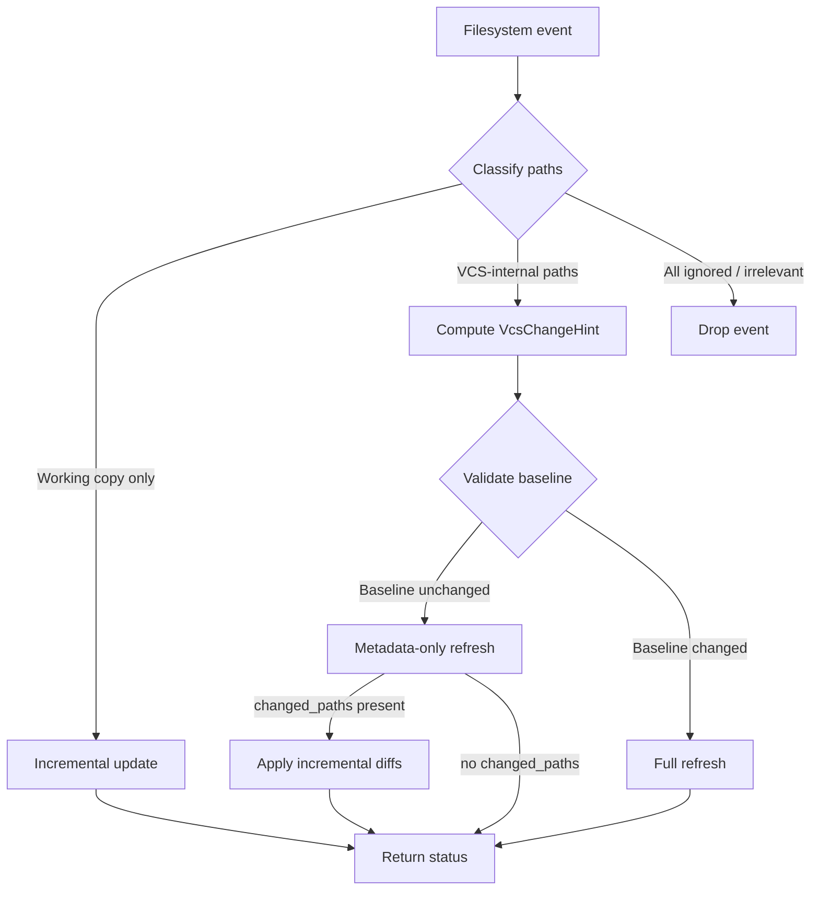
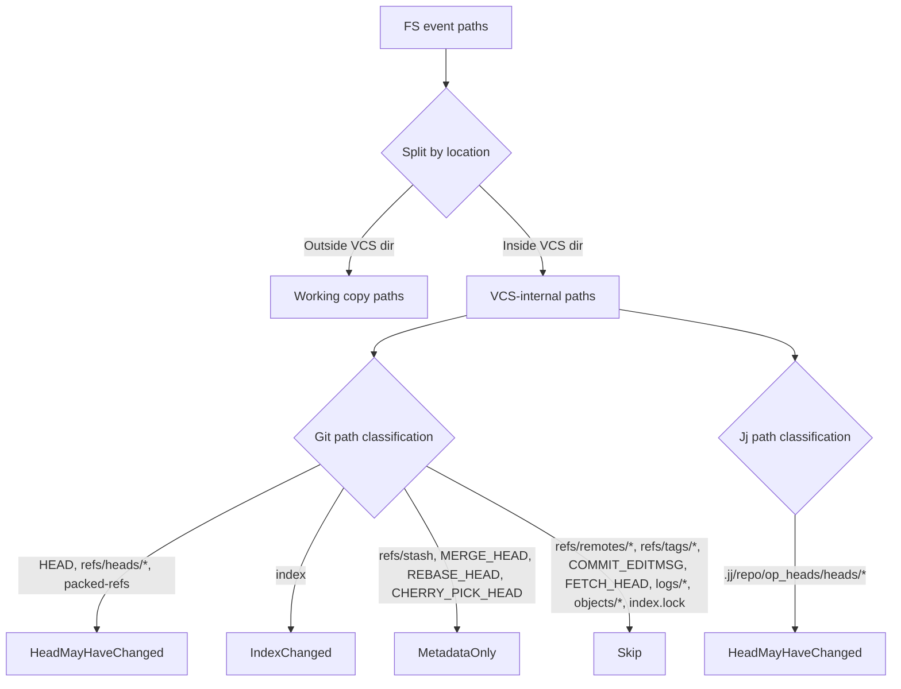
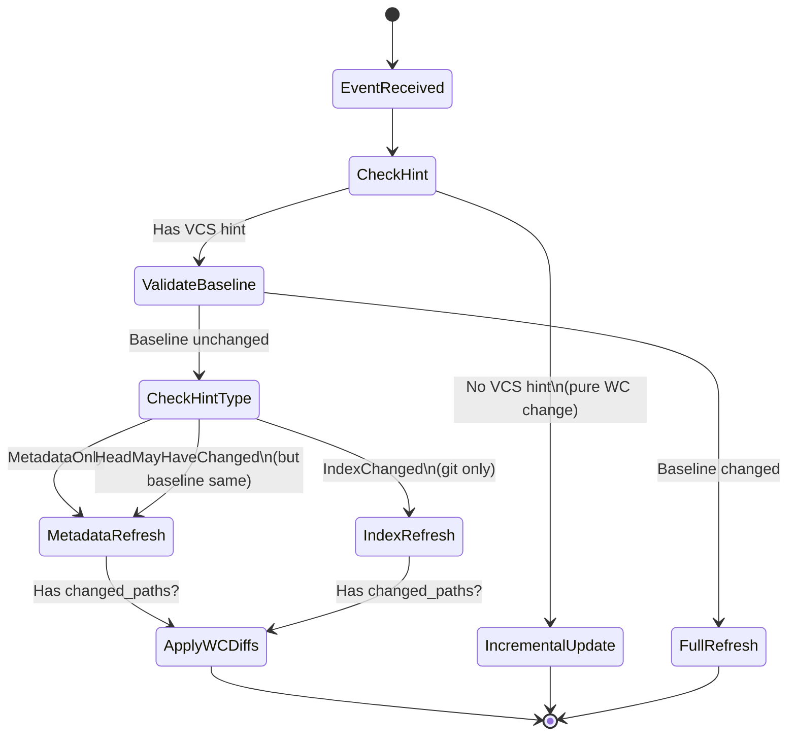
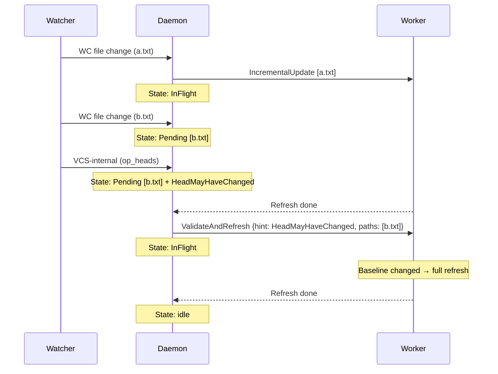

# Incremental Diff Algorithm

The daemon maintains a cached diff baseline and an incremental overlay so that
most filesystem events can be handled without recomputing the entire VCS status
from scratch. This document describes how the incremental state is maintained,
what events invalidate it, and how VCS-internal filesystem events are classified
to minimize unnecessary full refreshes.

## Overview



## Retained State

For each watched repository the daemon retains state from the last full refresh.
Incremental updates modify an **overlay** on top of this baseline rather than
recomputing everything.

### Jj repos

| Field | Description |
|---|---|
| **Parent tree** | Merged tree of the working-copy commit's parent commits. This is the diff baseline — all per-file diffs compare the on-disk file against the parent tree entry. |
| **Parent tree IDs** | The `Merge<TreeId>` identifying the parent tree. Used to detect whether the baseline has changed after a VCS operation. |
| **Base file stats** | Per-file diff statistics from the initial full diff (parent tree vs working-copy commit tree). |
| **Overlay** | Per-file overrides computed from disk reads. `Some(stats)` overrides a base entry; `None` means the file has reverted to match the parent (excluded from diff). |
| **Base status** | All non-diff metadata: change ID, commit ID, description, bookmarks, conflict/divergent/hidden/immutable flags, workspace name. |

### Git repos

| Field | Description |
|---|---|
| **HEAD tree OID** | The object ID of HEAD's tree. This is the diff baseline for "total" stats. |
| **Base unstaged** | Per-file stats from the index → working directory diff. |
| **Base total** | Per-file stats from the HEAD tree → working directory (including staged) diff. |
| **Unstaged overlay** | Per-file overrides for the unstaged diff. |
| **Total overlay** | Per-file overrides for the total diff. |
| **Base status** | Branch name, stash count, upstream ahead/behind, staged file counts, merge/rebase/cherry-pick state. |

## Refresh Types

### Full refresh

Recomputes everything from scratch: reloads the repository, computes the
complete tree diff, replaces all retained state. Triggered when the diff baseline
has changed.

### Metadata-only refresh

Reloads the repository to pick up new metadata (description, bookmarks, branch
name, stash count, conflict state, etc.) but **keeps the overlay and baseline
diffs intact**. Only the non-diff fields of the base status are updated.

If working-copy file changes were also detected in the same event, incremental
file diffs are applied against the existing parent tree / HEAD tree after the
metadata update.

### Incremental update

Diffs only the specific files that changed on disk against the retained parent
tree (jj) or HEAD tree + index (git). Updates the overlay maps for those files.
No repository reload needed.

### Index refresh (git only)

Triggered when `.git/index` changes (e.g. `git add`). The HEAD tree OID is
unchanged but the staging area is different, so all three diffs (staged,
unstaged, total) are recomputed and overlays are cleared. Metadata is preserved.

## Event Classification

Filesystem events are classified in two tiers: first by path (cheap, at the
watcher level), then by semantic validation (at the worker level, only for
VCS-internal events).

### Tier 1: Path-based hints

Each VCS-internal path in a filesystem event is mapped to a **hint** indicating
what *might* have changed:



When a single event contains multiple VCS-internal paths with different hints,
the **most severe** hint wins:

```
HeadMayHaveChanged > IndexChanged > MetadataOnly > Skip
```

If all VCS-internal paths classify as **Skip** and all working-copy paths are
ignored, the event is suppressed entirely.

#### Git path classification

| Path | Hint | Rationale |
|---|---|---|
| `.git/HEAD` | HeadMayHaveChanged | HEAD commit may have changed |
| `.git/refs/heads/*` | HeadMayHaveChanged | Branch tip moved |
| `.git/packed-refs` | HeadMayHaveChanged | Refs repacked |
| `.git/index` | IndexChanged | Staging area changed |
| `.git/refs/stash` | MetadataOnly | Stash count changed |
| `.git/MERGE_HEAD` | MetadataOnly | Merge state changed |
| `.git/REBASE_HEAD` | MetadataOnly | Rebase state changed |
| `.git/CHERRY_PICK_HEAD` | MetadataOnly | Cherry-pick state changed |
| `.git/refs/remotes/*` | Skip | Remote tracking only |
| `.git/refs/tags/*` | Skip | Tags don't affect local diffs |
| `.git/COMMIT_EDITMSG` | Skip | Editor temp file |
| `.git/FETCH_HEAD` | Skip | Fetch metadata |
| `.git/logs/*` | Skip | Reflogs |
| `.git/objects/*` | Skip | Object store |
| `.git/info/*` | Skip | Auxiliary info |
| `.git/index.lock` | Skip | Transient lock file |
| Unknown | HeadMayHaveChanged | Conservative default |

#### Jj path classification

All changes to `.jj/repo/op_heads/heads/*` produce **HeadMayHaveChanged**. Every
jj operation (describe, bookmark, rebase, new, commit, etc.) creates a new
operation head. The path alone cannot distinguish a description change from a
rebase — that distinction is made in tier 2.

### Tier 2: Semantic validation

When a VCS-internal event is detected, the worker validates whether the diff
baseline actually changed before deciding the refresh strategy.



#### Jj baseline validation

After reloading the workspace and repository (necessary to read the new
operation), the worker computes the new parent tree IDs
(`commit.parent_tree().tree_ids()`) and compares them to the cached value:

- **Same parent tree IDs** → metadata-only refresh. The diff overlay remains
  valid. Update description, bookmarks, change ID, commit ID, conflict/divergent
  /hidden/immutable flags, workspace name, and empty status from the new commit.
- **Different parent tree IDs** → full refresh. The diff baseline has changed
  (e.g. rebase changed the parents), so all per-file stats must be recomputed.

This correctly handles common jj operations:

| Operation | Parent tree changes? | Refresh type |
|---|---|---|
| `jj describe` | No | Metadata-only |
| `jj bookmark create/set` | No | Metadata-only |
| `jj rebase` | Yes | Full |
| `jj new` | Yes | Full |
| `jj commit` | Yes | Full |
| `jj edit` | Yes | Full |
| `jj squash` | Yes | Full |

#### Git baseline validation

After opening the repository (cheap with libgit2), the worker reads the HEAD
tree OID and compares to the cached value:

- **Same OID + MetadataOnly hint** → re-read branch, stash count, ahead/behind,
  conflict/rebase state. Keep all diffs and overlays.
- **Same OID + IndexChanged hint** → re-diff staged (HEAD→index), unstaged
  (index→workdir), and total (HEAD→workdir+index). Clear overlays.
- **Same OID + HeadMayHaveChanged** → HEAD didn't actually change; treat as
  metadata-only.
- **Different OID** → full refresh.

| Operation | HEAD tree changes? | Hint | Refresh type |
|---|---|---|---|
| `git commit` | Yes | HeadMayHaveChanged | Full |
| `git rebase` | Yes | HeadMayHaveChanged | Full |
| `git checkout` | Yes | HeadMayHaveChanged | Full |
| `git reset` | Usually | HeadMayHaveChanged | Full |
| `git add` | No | IndexChanged | Index refresh |
| `git stash` | No | MetadataOnly | Metadata + incremental WC diffs |
| `git stash pop` | No | MetadataOnly | Metadata + incremental WC diffs |
| `git fetch` | N/A | Skip | No refresh |
| `git merge` (fast-forward) | Yes | HeadMayHaveChanged | Full |

## Event Coalescing

When a refresh is already in flight for a repository and new events arrive, they
are coalesced into a pending state rather than queued individually.



Hints coalesce by taking the maximum severity. Working-copy paths accumulate.
Both are independent axes — the hint tells the worker what VCS state might have
changed, and the paths tell it which working-copy files to incrementally update
if the baseline is unchanged.

## Incremental Diff Mechanics

### Jj: overlay merging

The final diff statistics are computed by merging the base per-file stats with
the overlay:

1. For each file in the base: if the overlay has `Some(new_stats)`, use the
   overlay value. If `None`, the file has reverted to match the parent — exclude
   it. If absent from overlay, use the base value.
2. For each file in the overlay not in the base: these are new files created
   after the initial snapshot. Include `Some(stats)`, skip `None`.

### Git: dual overlay

Git maintains two parallel overlay tracks because the index (staging area) is an
independent layer:

- **Unstaged overlay**: tracks changes to the index→workdir diff for specific files.
- **Total overlay**: tracks changes to the HEAD→workdir+index diff for specific files.

Both overlays are merged with their respective base stats using the same
algorithm as jj. Staged stats (HEAD→index) are not tracked incrementally — they
are part of the base status and are fully recomputed on index changes.
